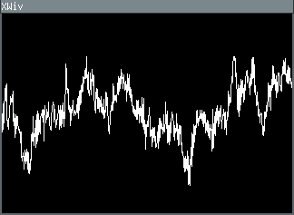
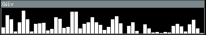
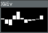

# XWiv
XWiv is a small program for visualising sound in various ways
using Xlib.  
It uses the Open Sound System (OSS) as a playback backend.  
Tested on FreeBSD and Linux ([See linux details](#linux))





## Compilation
The only build dependency is Xlib.
Use `make` to build the executable.

## Usage
XWiv can be invoked as follows:
```
xwiv [-r rate -f format -c channels] [-v volume] -m method <file>
```
If the *file* is `-`, XWiv reads from the standard input.

The *method* specifies the visualisation method to be used; the
currently supported methods are:
  * `wave` Draw the raw chunk as a wave
  * `bars` Draw the absolute values of the raw chunk as a series of bars
           ranging from top to bottom.
  * `bars2` Similar to `wave`, except drawn as a series of bars

If the `-r`, `-f` and `-c` options are specified, XWiv treats the
input as a raw PCM stream, otherwise it should be RIFF WAVE (.wav).
* The *rate* is an integer specifying the sampling rate.
* The *format* specifies the sample format; the currently supported
  formats are:
  * `s16le` (Signed 16 bit little endian).
* The *channels* value is an integer specifying the number of interleaved
  channels.
* The optional *volume* is an integer (0-100) specifying the playback volume.

## Examples
**Play the file ~/music/track.wav visualised as a wave**
```
xwiv -m wave ~/music/track.wav
```
**Visualise default microphone input using FFmpeg (OSS) as wave made up of bars**
```
ffmpeg -f oss -channels 2 -sample_rate 48000 -i /dev/dsp -f s16le - | xwiv -r 48000 -f s16le -c 2 -v 0 -m bars2 -
```

## Linux
If you're lucky, you'll be able to run XWiv on Linux without any issues using `aoss`, 
the ALSA OSS binary compatibility layer (package `alsa-oss`). You can do so
by just prefixing the XWiv command with `aoss`, e.g. `aoss xwiv -m wave ~/music/track.wav`.
XWiv wasn't made wth Linux in mind, but there is an effort to keep it at least somewhat 
functional, even though some features might be missing.
